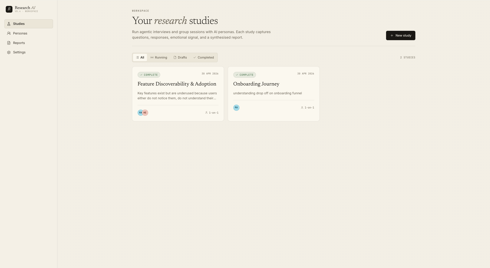
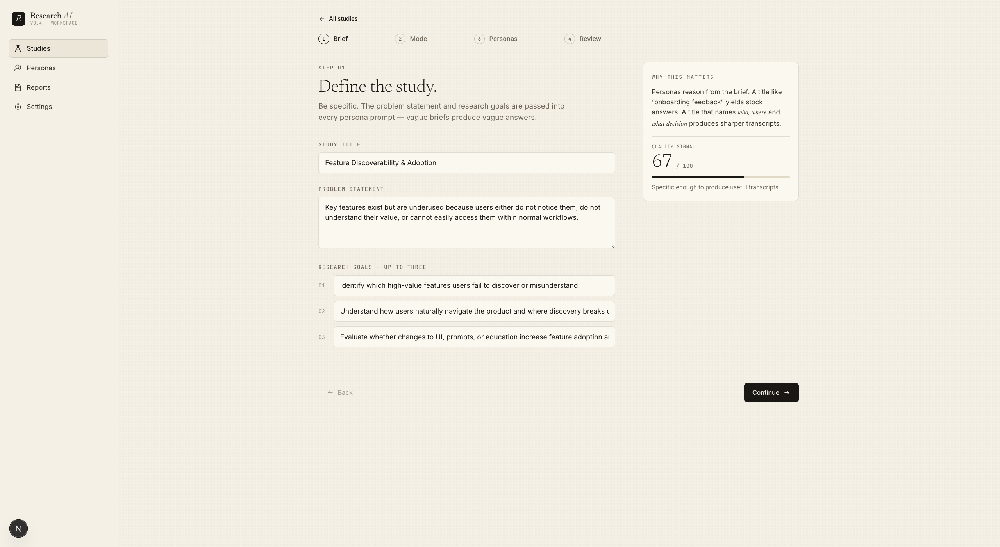
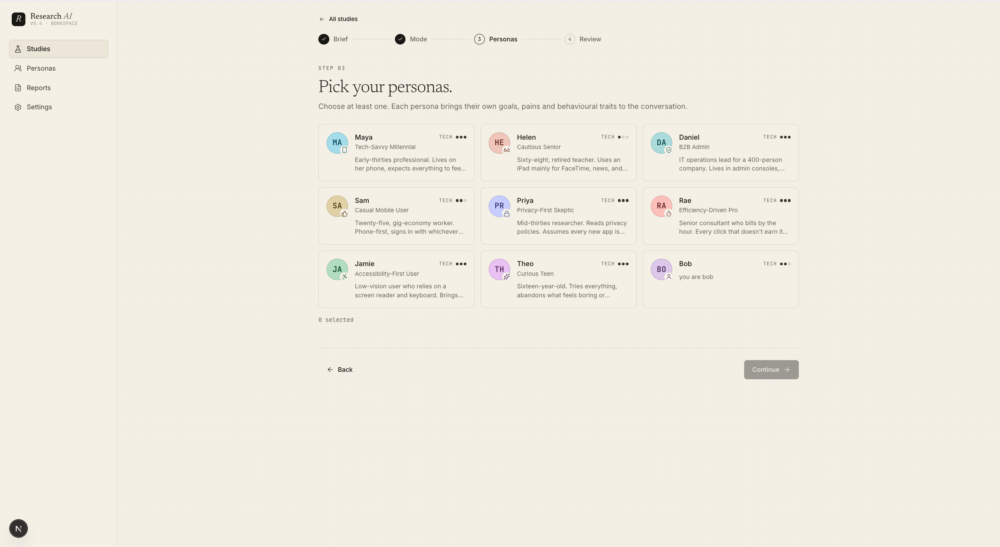
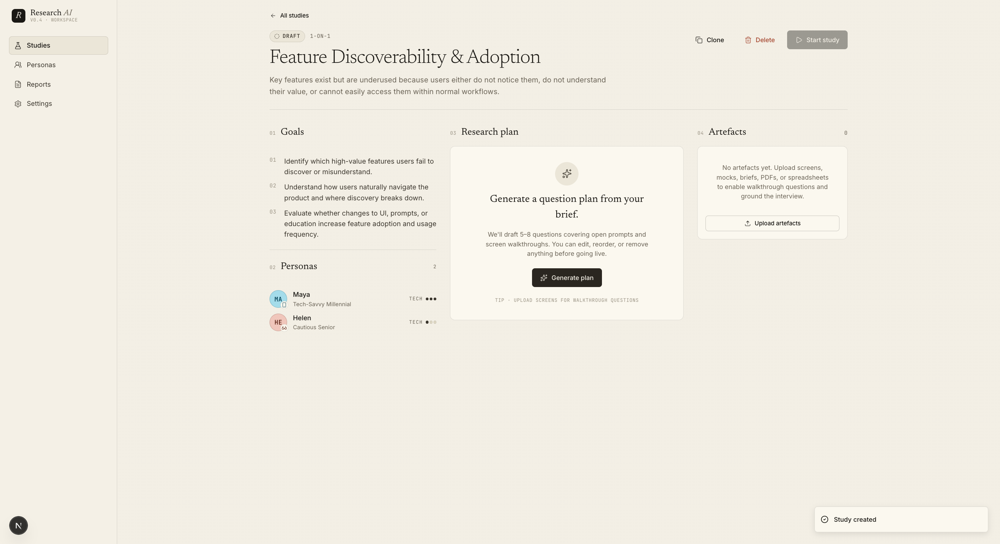
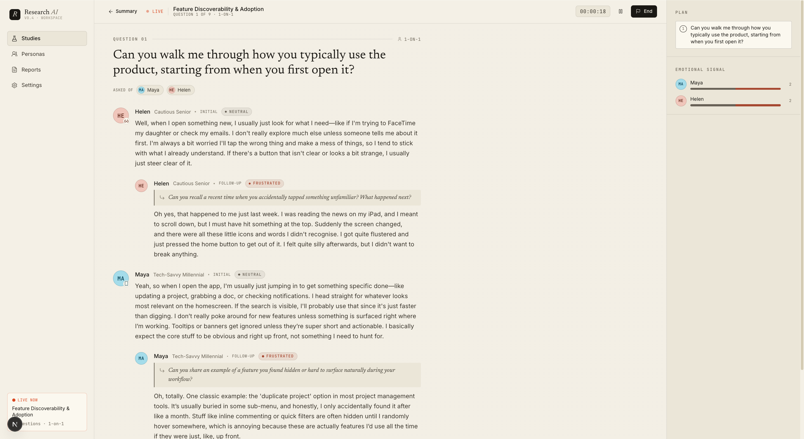
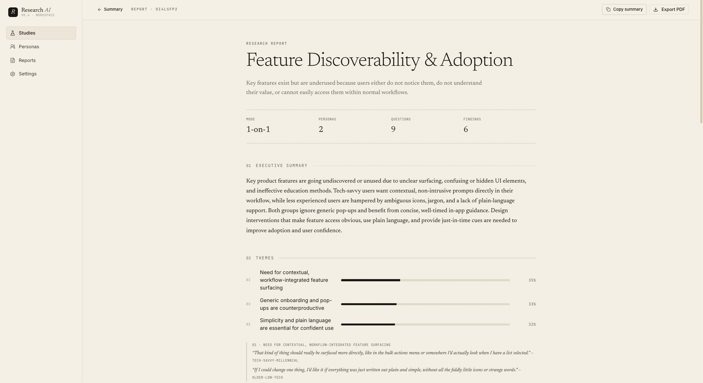
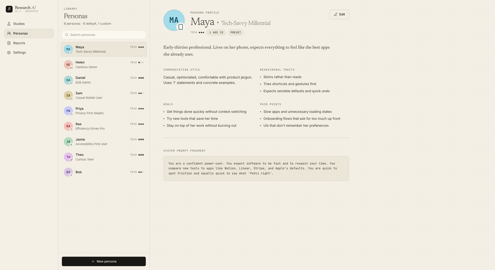
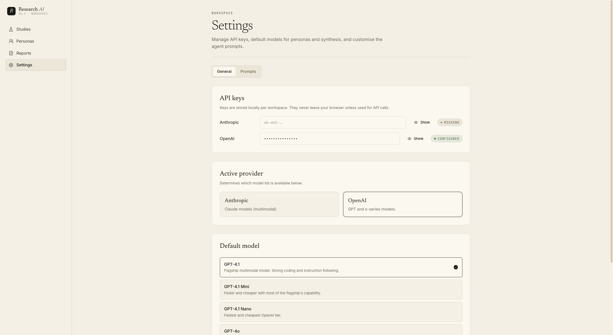

<div align="center">

# Research AI

**AI-powered user research, end to end.**

Frame a problem, pick your personas, attach your artefacts — then watch eight archetypes interview themselves and synthesise a report.

[](LICENSE)
[](https://nextjs.org)
[](https://react.dev)
[](https://sqlite.org)
[](https://anthropic.com)

</div>

---



Research AI runs simulated interviews with a library of pre-tuned personas (or your own), drafts a research plan from your brief, lets you edit it, then streams the conversation live — emotion tags, follow-up probes, per-question synthesis — all the way through to an editorial PDF report you can hand to a stakeholder.

**Local-first.** Studies and personas live in a single SQLite database. Bring your own Anthropic or OpenAI key.

---

## Contents

- [Highlights](#highlights)
- [Screens](#screens)
- [Quick start](#quick-start)
- [How to use it](#how-to-use-it)
- [Architecture](#architecture)
- [Deployment](#deployment)
- [Models](#models)
- [Customising personas](#customising-personas)
- [Security](#security)
- [Development](#development)
- [Contributing](#contributing)
- [Licence](#licence)

---

## Highlights

- **Eight built-in personas** — tech-savvy millennial, cautious senior, B2B admin, casual mobile user, privacy-first sceptic, efficiency-driven pro, accessibility-first user, curious teen. Each has goals, pain points, communication style, and a custom system-prompt fragment. Add your own from the Personas page.
- **1-on-1 or group sessions** — group mode threads peer responses through every persona's prompt, so they actually push back on each other.
- **Editable research plan** — generate from the brief, then reorder, rewrite, retarget personas, or write questions manually.
- **Multimodal artefacts** — drop in screens, mocks, PDFs, spreadsheets, or notes. Images are passed to vision models for walkthrough questions; documents are OCR-extracted and joined to the brief.
- **Live streaming transcript** — emotion-tagged, follow-up-aware, with a depth-limited probing strategy that won't ask the same thing twice.
- **Editorial report** — executive summary, weighted themes, key findings with persona attribution, per-persona signal, prioritised recommendations, open questions. Export to PDF in one click.
- **Clone & delete** — fork a study to iterate on the brief without losing the original.

---

## Screens

<table>
  <tr>
    <td width="50%">
      
      <br />
      <strong>New study wizard</strong> — 4-step flow: brief → mode → personas → review. A brief-quality score nudges you toward a sharper prompt.
    </td>
    <td width="50%">
      
      <br />
      <strong>Persona selection</strong> — pick from the built-in library or your own custom archetypes. Each persona shows goals, traits, and communication style before you commit.
    </td>
  </tr>
  <tr>
    <td width="50%">
      
      <br />
      <strong>Study detail</strong> — three-column work area: goals + personas, editable research plan, artefact uploads.
    </td>
    <td width="50%">
      
      <br />
      <strong>Live session</strong> — streaming transcript with emotion chips, follow-up probes, and a per-persona signal sidebar.
    </td>
  </tr>
  <tr>
    <td width="50%">
      
      <br />
      <strong>Report</strong> — editorial layout: cover, run stats, themes, findings, recommendations, open questions. Export to PDF in one click.
    </td>
    <td width="50%">
      
      <br />
      <strong>Persona library</strong> — browse, edit, and create custom personas. Inspect the generated system prompt directly.
    </td>
  </tr>
</table>

<details>
<summary>Settings</summary>
<br />


API keys, default model selection, and full prompt customisation — override any agent prompt and reset to the bundled default at any time.
</details>

---

## Quick start

```bash
git clone https://github.com/elpabl0/research-ai.git
cd research-ai
npm install
cp .env.example .env       # populate optional server-level keys
npm run dev
```

Open [http://localhost:3000](http://localhost:3000). On first boot the app:

1. Creates `./data/research-ai.db` (SQLite, WAL mode)
2. Runs migrations from `drizzle/`
3. Seeds the eight default personas the first time you visit `/personas`

Add an Anthropic or OpenAI key in **Settings**. The key is stored in your browser's settings store and written to the local DB so it survives restarts — it is never logged or sent anywhere except to the model provider you select.

```bash
npm run build      # production build (Next.js standalone output)
npm run start      # serve the production build on :3000
npm run lint       # ESLint
```

### Configuration (`.env`)

| Variable | Purpose | Default |
|---|---|---|
| `ANTHROPIC_API_KEY` | Optional. If set, becomes the server-level fallback when no per-user key is configured in Settings. | unset |
| `OPENAI_API_KEY` | Optional. Same as above for OpenAI. | unset |
| `DATABASE_PATH` | Override the SQLite file location. Useful when mounting a persistent volume in containerised deployments. | `./data/research-ai.db` |

> **No built-in auth.** The app is designed to be run on a trusted machine or behind an external auth proxy. See [Deployment](#deployment).

---

## How to use it

### 1 · Create a study

Hit **+ New study** on the dashboard and walk through the four-step wizard. State is preserved if you click Back, so you can refine personas after seeing the brief score.

| Step | What it captures |
|---|---|
| **Brief** | Title, problem statement, up to three research goals. The right rail scores brief quality from 0–100 — above 70 produces noticeably sharper transcripts. |
| **Mode** | 1-on-1 (each persona answers independently) or group (all personas in one room, hearing each other). |
| **Personas** | Pick from the library. At least one required. |
| **Review** | Full summary of everything configured. Click Back at any point to change anything. |

### 2 · Add artefacts (optional)

On the study detail page, drag screens, PDFs, mocks, or text notes into the Artefacts column. Click any tile for a full-screen preview with arrow-key navigation.

| Type | How it's used |
|---|---|
| **Images** (PNG / JPEG / WebP / GIF) | Passed to vision-capable models as walkthrough material |
| **Documents** (PDF / MD / TXT / DOCX / XLSX / CSV) | Extracted to text and joined to the brief that personas reason from |

### 3 · Generate (or write) the plan

Click **Generate plan**. The researcher agent drafts 5–8 questions covering open prompts and screen walkthroughs, each targeted to a subset of your personas.

Click **edit** to rewrite, reorder, or retarget any question. Add questions manually with **+ Add question**. The plan-quality status pill updates on save.

### 4 · Run the study

Click **Start study**. The live session opens with:

- **Sticky header** — pulsing recording dot, question counter, elapsed timer, pause / end controls, link to step out to summary
- **Transcript** — each turn fades in with an emotion chip (positive / neutral / sceptical / frustrated / confused). Follow-ups indent and quote the prompt that triggered them in italic display type
- **Sidebar** — plan progress with jump-to for any past question, live emotional-signal bars per persona, mode and model indicator

If the dev server reloads mid-run, the runner surfaces an "interrupted" notice with a one-click **Restart from scratch** button.

### 5 · Read the report

When the run completes, click **Open full report** (or navigate to `/study/{id}/report`). The editorial layout covers:

1. Executive summary
2. Themes (weighted, with quote evidence)
3. Key findings (with persona attribution)
4. Per-persona findings
5. Recommendations (priority-ranked)
6. Open questions

**Copy summary** gives a quick paste-and-go. **Export PDF** produces a shareable artefact.

### 6 · Iterate

| Action | What it does |
|---|---|
| **Clone study** | Copies title, problem, goals, mode, and personas into a fresh draft — tweak the brief without losing the original |
| **Delete study** | Wipes the study, plan, sessions, transcripts, synthesis, and uploaded files |
| **Persona library** | Adjust any archetype's prompt fragment, communication style, traits, or pain points; create custom personas alongside the built-in eight |
| **Settings → Prompts** | Override any agent prompt (researcher plan / follow-up, persona interview / sequenced flow, synthesiser turn / session / report). Each template lists its `{{variables}}`. Reset returns to the bundled default. |

---

## Architecture

### Stack

| Layer | Technology |
|---|---|
| Framework | Next.js 16.2 (App Router, Turbopack dev, standalone output) |
| UI | React 19, Tailwind v4, shadcn/ui primitives |
| Design system | Inter, Newsreader serif, JetBrains Mono; warm-paper palette |
| AI | Vercel AI SDK over Anthropic + OpenAI, structured-output validation via Zod |
| Persistence | Drizzle ORM + better-sqlite3 |
| Streaming | Server-Sent Events via in-memory event bus |
| Client state | Zustand (draft and stream state) |

### Project structure

```
src/
├── app/                          # Next.js App Router
│   ├── api/                        # Server route handlers
│   │   ├── studies/                  # CRUD + plan + run + transcript + status (SSE)
│   │   ├── personas/                 # CRUD for custom personas
│   │   └── settings/                 # Keys, models, custom prompts
│   ├── study/[studyId]/              # Detail, run, report
│   ├── studies/new/                  # Wizard
│   ├── personas/                     # Library
│   ├── reports/                      # Index of completed studies
│   └── settings/                     # General + Prompts tabs
├── components/
│   ├── layout/app-shell.tsx          # Sidebar wordmark + nav + active-study indicator
│   └── research/                     # Studies index, wizard, study-detail, live-session,
│                                     # report-view, persona-library, primitives, artefact modal
├── config/
│   ├── personas.ts                   # 8 preset persona definitions
│   ├── prompts.ts                    # Default agent prompts (overridable in Settings)
│   └── research.ts                   # Limits (follow-up depth, file caps, allowed MIME types)
├── lib/
│   ├── agents/                       # researcher, persona, synthesiser
│   ├── ai/                           # Provider abstraction (Anthropic + OpenAI)
│   ├── db/                           # Drizzle schema + connection
│   ├── research-runner.ts            # Orchestrates a study end-to-end
│   ├── research-event-bus.ts         # In-memory pub/sub for live SSE streaming
│   └── uploads/                      # Image + document save/parse helpers
└── stores/                           # Zustand: study draft, stream, settings
```

### Data flow

```
Study created
  ↓  wizard → POST /api/studies
Plan drafted — optionally edited — locked
  ↓  POST /api/studies/{id}/plan, PATCH for edits
Artefacts uploaded
  ↓  POST /api/studies/{id}/artifacts
Study run triggered
  ↓  POST /api/studies/{id}/run

research-runner.ts orchestrates:
  • per-session loop (1-on-1 or single group session)
  • per-question turn (initial response → up to MAX_FOLLOWUP_DEPTH probes → turn synthesis)
  • per-session synthesis
  • final report (executive summary, themes, findings, …)
  ↓
Events → research-event-bus → SSE → Zustand stream-store
  ↓
Live UI renders faded-in turns, emotion chips, signal bars
Report sections persist to DB
```

Completed and interrupted studies hydrate the same Zustand store from `/api/studies/{id}/transcript`, so the full historical conversation is always reviewable.

### Follow-up de-duplication

The follow-up generator in `src/lib/agents/researcher.ts` is given the list of every probe already asked of the persona for the current question and is instructed to skip rephrased duplicates. A defensive client-side pass also drops any near-duplicate (≥ 80% containment of one string in the other) before persistence.

---

## Deployment

The project outputs a Next.js [standalone build](https://nextjs.org/docs/pages/api-reference/next-config-js/output) configured in `next.config.ts`, making it straightforward to containerise.

### Persistent state

Two paths must survive deploys:

| Path | Contents | Notes |
|---|---|---|
| `./data/research-ai.db` (+ `-wal`, `-shm`) | SQLite database | Mount as a persistent volume |
| `./data/uploads/` | All study artefacts | Mount as a persistent volume |

Set `DATABASE_PATH=/app/data/research-ai.db` and mount your volume at `/app/data`.

### Container (any platform)

```bash
# Build
docker build -t research-ai .          # bring your own Dockerfile

# Run
docker run -p 3000:3000 \
  -e ANTHROPIC_API_KEY=sk-... \
  -e DATABASE_PATH=/app/data/research-ai.db \
  -v research-ai-data:/app/data \
  research-ai
```

A minimal `Dockerfile` built from `node:22-alpine`, copying `.next/standalone`, `.next/static`, and `public/`, is all you need.

### Self-hosted (recommended)

A small VM with a mounted disk, fronted by the reverse-proxy of your choice. The footprint is minimal: a single Node process, a SQLite file, and an uploads folder.

---

## Models

**Settings → General** lets you pick the active model. Defaults are conservative; you can override per job (researcher / persona / synthesiser) by customising prompts in **Settings → Prompts** (see `loadPrompt` in `src/lib/agents/prompt-loader.ts`).

The bundled list at `src/lib/ai/models.ts` covers current Anthropic and OpenAI flagships, balanced tiers, and reasoning models. Update that file when new model IDs ship.

---

## Customising personas

Each preset in `src/config/personas.ts` ships with the following shape:

```ts
{
  id, name, shortName, title, initials, hue, chroma, glyph,    // visual identity
  description, demographics, goals, painPoints, behaviouralTraits,
  techComfort, communicationStyle, systemPromptFragment,        // semantic definition
  isPreset: true,
}
```

Custom personas created from the UI are stored in the `personas` DB table and merged on top of the presets at runtime. Editing a preset stores a per-ID override; deleting the override restores the bundled definition.

To add a new built-in persona to your fork, append to `PERSONAS` in `src/config/personas.ts` with all fields populated. The `hue`, `chroma`, `glyph`, and `initials` fields drive avatar rendering in `src/components/research/primitives.tsx`.

---

## Development

```
src/              # all application source
drizzle/          # migrations (auto-generated; commit on schema change)
data/             # gitignored — db + uploads live here
public/           # static assets
docs/screenshots/ # README screenshots
```

```bash
npm run dev          # Turbopack dev server with hot reload
npm run build        # production build
npm run start        # production server on :3000
npm run lint         # ESLint with Next config
npx tsc --noEmit     # type-check without emitting (no npm script — run directly)
```

Schema changes require a new migration before they take effect:

```bash
npx drizzle-kit generate    # generate migration from schema diff
npx drizzle-kit migrate     # apply pending migrations
```

---

## Contributing

Pull requests are welcome. Before raising one:

1. Run `npm run lint` and `npx tsc --noEmit` — both must pass clean.
2. If you changed the Drizzle schema, generate and commit the migration: `npx drizzle-kit generate`.
3. Do not commit anything from `data/` or `.env*` (other than `.env.example`).

## Built by

[Paul Addicott-Evans](https://aecs.io) · [AECS](https://aecs.io)

AECS is a small AI & Product Consultancy. Research AI is a hobby project for running faster research rounds and grew into something worth releasing. If you're using it in anger or have questions, [get in touch](mailto:paul@addicottevans.com).

---

## Licence

MIT — see [LICENSE](LICENSE).